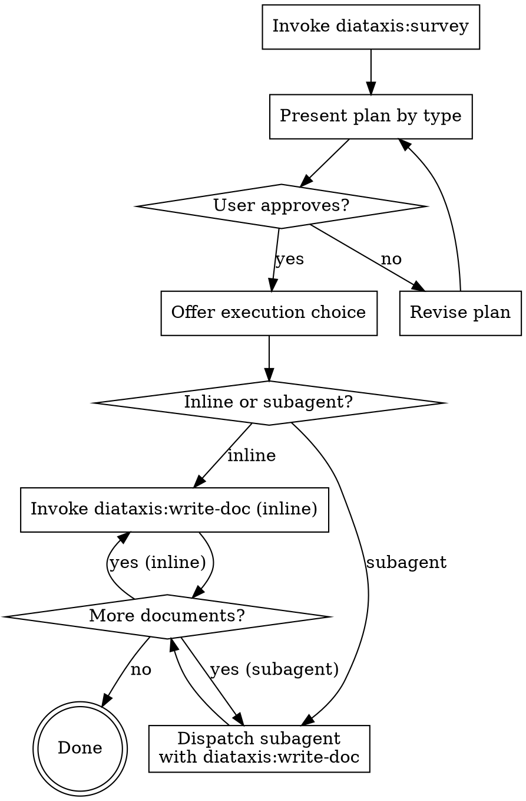

# Diataxis: Document

Survey the project, produce a gap analysis and plan by documentation type, confirm with the user, then write every approved document one at a time.

**Announce at start:** "I'm using the diataxis:document skill to survey and plan improvements to your project's documentation."

<HARD-GATE>
Do NOT write a single word of documentation until the user has explicitly approved the plan. This applies even when the gaps are obvious.
</HARD-GATE>

## Checklist

Create a todo for each item and complete them in order:

1. **Invoke `diataxis:survey`** — receive the structured gap analysis and documentation plan
2. **Present the plan and confirm with the user** — present the full structured output from `diataxis:survey` verbatim using the required format; ask about language and style preferences at the end of the presentation; wait for explicit approval or adjustments; revise and present again if changes are requested
3. **Offer execution choice** — inline (this session) or subagent per document
4. **Write documents one at a time** — invoke `diataxis:write-doc` for each approved item; `diataxis:write-doc` commits each document internally — do not commit separately

## The Process

## Presenting the Plan

Present the plan in this format exactly. Do not paraphrase or summarise — show the full structured output from `diataxis:survey`.

> "Here's what I found.
>
> **Existing docs:** [one-sentence summary of what exists and how it classifies]
>
> **Biggest gaps:** [list the most urgent missing types]
>
> **Proposed plan:**
>
> ### Tutorials (N existing → M proposed)
>
> - [x] "Title" _(exists, good shape)_
> - [~] "Title" _(exists — needs [specific improvement])_
> - [ ] "Title" — one-line purpose
>
> ### How-to guides (N existing → M proposed)
>
> - [ ] "Title" — one-line purpose
>
> ### Reference (N existing → M proposed)
>
> - [ ] "Title" — one-line purpose
>
> ### Explanation (N existing → M proposed)
>
> - [ ] "Title" — one-line purpose
>
> **Documentation toolchain:** [toolchain from survey — e.g. "MkDocs (`mkdocs.yml` detected) — I'll write `.md` files in `docs/` using mkdocstrings for API reference."] Is this correct, or would you prefer a different tool?
>
> Before I start writing: what English variant do you prefer (UK / US / other)? Any tone or style conventions I should follow?"

Wait for explicit approval. If the user requests changes, update the plan and present it again. Only proceed to the execution choice once the user says yes.

If the user declines or cancels the plan entirely, stop. Report that no documents were written. Do not re-present the plan unless the user explicitly asks.

If the user approves only a subset of proposed documents, remove the rejected items from the plan and proceed with the approved subset only. Do not write any document the user has not approved.

## Execution Choice

After plan approval, present exactly this:

> "Two options for writing the documents:
>
> **1. Subagent per document (recommended)** — I dispatch a fresh subagent for each document with isolated context. Better for four or more documents.
>
> **2. Inline** — I write each document in this session, one after another. Simpler for three documents or fewer.
>
> Which approach?"

**If subagent chosen:** Dispatch one subagent per document. Provide each subagent with: the document type, title, one-line purpose, the project summary from the survey, the confirmed documentation toolchain, the agreed language and style preferences, and the instruction to use `diataxis:write-doc`.

**If inline chosen:** Invoke `diataxis:write-doc` directly for each item in the approved plan, in priority order, passing the document type, title, one-line purpose, project summary, confirmed documentation toolchain, and agreed language and style preferences.

**REQUIRED SUB-SKILLS:**

- `diataxis:survey` — produces the gap analysis and plan
- `diataxis:write-doc` — writes each individual document
